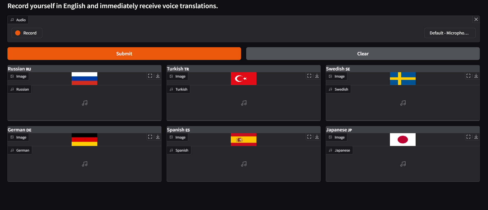
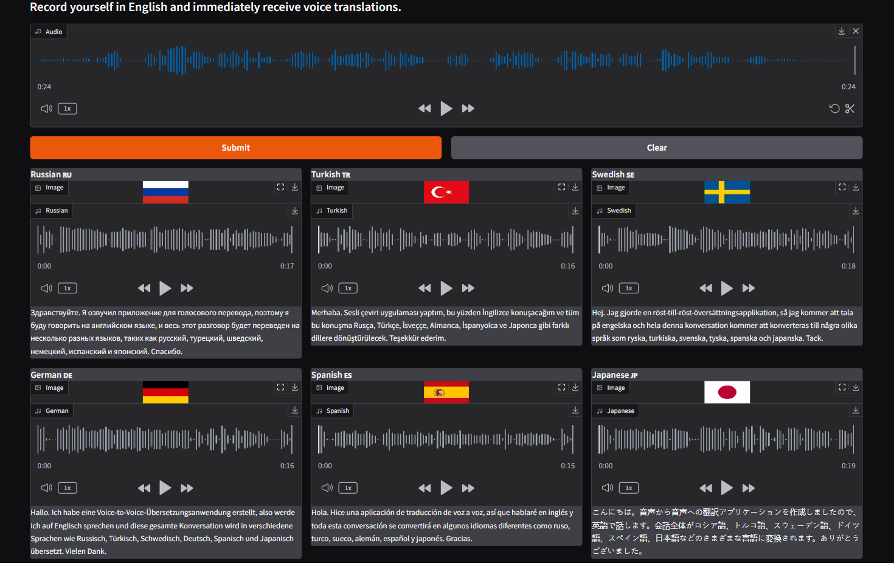

# Voice-to-Voice Translator

## Overview

This project is a voice-to-voice translator that allows users to speak in English and receive real-time translations in multiple languages, along with audio playback. The application leverages advanced AI-based speech recognition, translation, and text-to-speech technologies.

## Sample Images



## AI and Language Preservation

AI translation and AI voice acting technologies allow **movie viewers to choose any language** they desire for their viewing experience. These advancements enable seamless **translation and dubbing of films** into a multitude of languages, including **endangered or suppressed languages**.

By making films accessible in these languages, **AI helps preserve and promote linguistic diversity**, giving speakers of endangered languages the opportunity to experience global media in their **native tongue**. This fosters **cultural pride, continuity, and language revitalization**, ensuring that languages at risk of disappearing remain part of our shared human heritage.

## Technologies Used

- **Gradio** – Provides an easy-to-use web interface.
- **AssemblyAI** – Converts speech to text.
- **Python Translate Module** – Translates text into multiple languages.
- **ElevenLabs** – Converts translated text into spoken audio using AI voices.

## Installation

1. Clone this repository:
   ```sh
   git clone https://github.com/yourusername/voice-to-voice-translator.git
   cd voice-to-voice-translator
   ```
2. Install dependencies:
   ```sh
   pip install -r requirements.txt
   ```
3. Set up your API keys by creating a `.env` file in the root directory:
   ```ini
   ASSEMBLYAI_API_KEY=your_assemblyai_api_key
   ELEVENLABS_API_KEY=your_elevenlabs_api_key
   ```
4. Run the application:
   ```sh
   python src/voice_translator.py
   ```

## API Keys Required

You need API keys for the following services:

- [AssemblyAI API Key](https://www.assemblyai.com/?utm_source=youtube\&utm_medium=referral\&utm_campaign=yt_mis_66)
- [ElevenLabs API Key](https://elevenlabs.io/)

## Features

- **Speech Recognition**: Converts spoken words into text using AssemblyAI.
- **Translation**: Uses Python’s `translate` module to support multiple languages.
- **Text-to-Speech**: ElevenLabs API generates AI-powered speech from translated text.
- **Real-time Streaming**: Supports streaming audio generation for faster output.
- **User-Friendly Interface**: Built using Gradio for a simple and interactive UI.

## Usage

- Click on the **Record** button to capture your speech.
- The system will transcribe, translate, and generate speech output in multiple languages.
- Download or listen to the translated audio directly from the interface.
